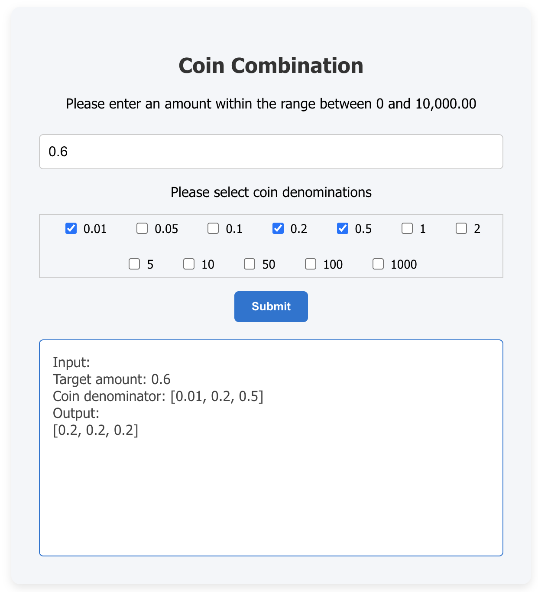

# Full-Stack Coin Combination Application

This repository contains a full-stack application which calculates **minimum number of coins needed to make up a target amount**, it is composed of a **backend API service(java and dropwizard)**, **a frontend user interface(react)**, and an Nginx reverse proxy. All services are containerized and managed with Docker.
<p align="center">
  
</p>

## 🚀 Quick Start

### Prerequisites

Before you begin, please ensure you have **[Docker](https://www.docker.com/get-started/)** installed on your system.

### Build and Run All Services

1.  **Clone the project repository:**
    ```bash
    git clone https://github.com/Lunar-lau/2025_liushuting.git
    cd 2025_liushuting
    ```

2.  **Build and start all services:**
    In the project's root directory (`2025_liushuting/`, where `docker-compose.yml` is located), execute:
    ```bash
    docker compose up --build -d
    ```
    This command will build all necessary Docker images (if they don't exist or are updated) and then start the `coin-combination` (backend), `coin-calculator-frontend` (frontend), and `main_nginx_proxy` (Nginx proxy) services, running them in the background.
3.  **Verify running services:**
    After the application successfully starts, you should see all three services running. You can check their status with:
    ```bash
    docker compose ps
    ```
    You should see `main_nginx_proxy`, `coin-calculator-frontend`, and `coin-combination` listed as `running`.

### Access the Application

Once all services are up and running, you can access the frontend application in your browser:

* **Frontend Application:** `http://localhost`
* **Dropwizard REST API Example:** `http://localhost/api/coins/6?coins=1,2`

### Stop All Services

To stop and remove all containers, networks, and volumes created by `docker compose`, execute:

```bash
docker compose down